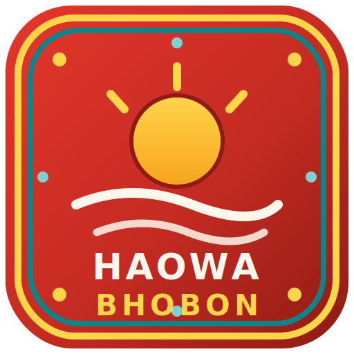

<div align="center">



# Haowa Bhobon — Mess Manager

**A realtime, offline-first meal and expense manager for shared housing.**

Daily meal scheduling · grocery (bazar) tracking · duty rotation · utility bills · exact month-end settlement

[](https://haowa-bhobon.web.app)


</div>

---

## Overview

Haowa Bhobon Mess Manager digitizes the daily operations of a shared mess:
who eats which meal, who bought this week's groceries, what the shared bills
are, and — at month end — exactly who pays and who receives. It replaces the
paper ledger with a single source of truth that every member sees live on
their phone.

The app is an installable PWA: it runs on Android, iOS, and desktop from one
codebase, works offline, and updates instantly for everyone on each deploy.

## Features

| | Feature | Details |
|---|---|---|
| 🍛 | **Meal scheduling** | Meals default ON daily. Lunch locks at 09:30, dinner at 18:00 (Asia/Dhaka). Future days toggle any time. |
| 🌙 | **Away mode** | One tap turns lunch/dinner/both off across any date range — open-ended supported — with automatic return to ON. |
| 👨‍🍳 | **Cook counts** | Live "plates to cook" for lunch and dinner, today and tomorrow, including guests. |
| 🛒 | **Bazar tracking** | Emoji item picker with quantity, unit and price. Member-added custom items join the shared menu. Spending credits the buyer's balance. |
| 🔄 | **Duty rotation** | The manager assigns bazar duty over any date range (3-day cycles by default). |
| 💡 | **Utility bills** | Wi-Fi, water, gas, electricity, newspaper, cook salary and other costs, split equally among active members. |
| 📊 | **Exact settlement** | All money stored as integer paisa. Proportional meal-cost allocation with deterministic remainder distribution — member rows always reconcile to the month totals, to the paisa. |
| 🔒 | **Month finalize** | Freezes a month into an immutable snapshot; later edits cannot alter a settled month. |
| 📤 | **One-tap share** | Sends the settlement summary to any messaging app via the system share sheet. |
| 👥 | **Role-based access** | Admin, manager and member roles enforced by Firestore security rules — not just the UI. |
| 📴 | **Offline-first** | Persistent local cache; meal toggles apply instantly and sync when back online. |

## Architecture

```
React 18 + TypeScript (Vite)
├── Tailwind CSS 4          design system, theming
├── Framer Motion            micro-interactions, transitions
└── Firebase
    ├── Authentication       email/password + Google, allowlist gated
    ├── Cloud Firestore      realtime data, offline persistence, security rules
    └── Hosting              global CDN, free tier
```

**Financial integrity** — every stored amount is integer paisa (1 Tk = 100
paisa). Settlement math uses largest-remainder allocation so that per-member
costs sum *exactly* to the month totals; no floating-point drift can ever
appear in anyone's balance.

**Access model** — sign-in is open, but only emails present in the members
collection can read or write mess data. Members without an email yet
("pending") count in meals and bills but cannot log in. Rules enforce that a
member can only modify their own meals, bazar entries and leaves; managers
and admins hold elevated, audited powers.

## Getting started

```bash
git clone https://github.com/tanvir-ovi/haowa-bhobon.git
cd haowa-bhobon
npm install
cp .env.example .env   # paste your Firebase web app config
npm run dev
```

Create a free Firebase project, enable **Authentication** (Email/Password +
Google) and **Cloud Firestore**, then copy the web app config into `.env`.
Deploy the bundled security rules with:

```bash
firebase deploy --only firestore:rules
```

### Mobile preview on your LAN

```bash
npm run dev -- --host
```

Open the printed LAN URL on any phone connected to the same Wi-Fi.

## Deployment

```bash
npm run build
firebase deploy --only hosting
```

The site ships to `https://<project-id>.web.app`. Members install it from the
browser menu (*Add to Home Screen*) on Android and iOS. Every deploy reaches
all installed clients on their next launch — no app store round-trips.

## Monthly workflow

1. Members toggle meals daily (or set Away mode); guests are added per meal.
2. The duty member records groceries right from the shop.
3. The manager enters utility bills whenever they arrive.
4. At month end: **Report → Finalize → Share** — everyone sees exactly who
   pays and who receives.

## License

Released under the [MIT License](LICENSE).
